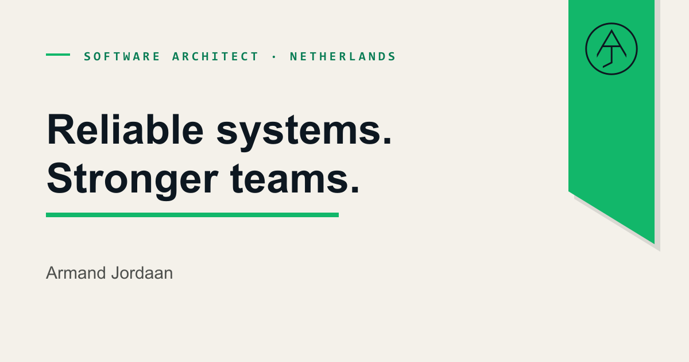
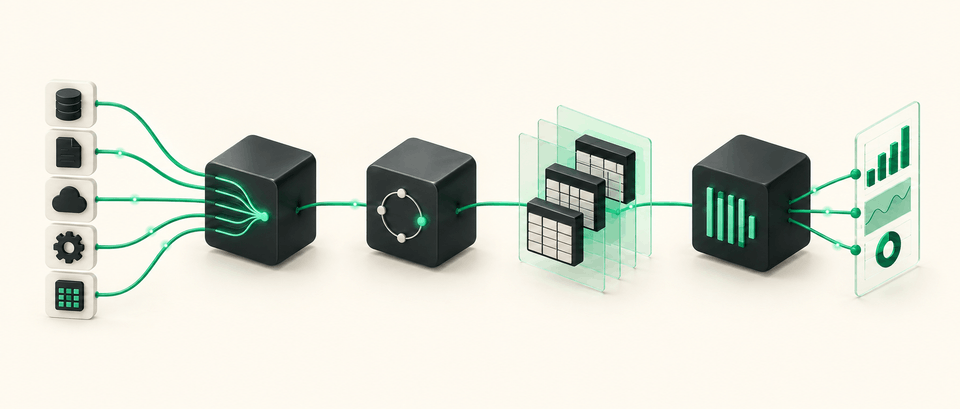

  

  <a href="https://armandjordaan.com/"><strong>Portfolio</strong></a>
  &nbsp;·&nbsp;
  <a href="https://armandjordaan.com/#experience"><strong>Case studies</strong></a>
  &nbsp;·&nbsp;
  <a href="https://armandjordaan.com/blog"><strong>Technical blog</strong></a>
  &nbsp;·&nbsp;
  <a href="https://www.linkedin.com/in/armandjordaan/"><strong>LinkedIn</strong></a>

## Building reliable systems and stronger engineering teams.

I’m a software architect based in the Netherlands. I add architectural direction and hands-on engineering capacity where teams need it most—aligning stakeholders, establishing pragmatic patterns and building technical ownership that lasts.

My background spans full-stack development, distributed systems, cloud platforms and data architecture across finance, insurance, banking, education and other high-volume environments. I stay close enough to implementation to make the direction real.

## Selected work

**[Building a data platform from zero](https://armandjordaan.com/work/data-platform/)**  
Designed a containerised warehouse and delivery platform that moved analytical processing out of the operational C# estate. The platform now processes more than 500 GB each day.

**[From legacy survey app to scalable digital platform](https://armandjordaan.com/work/legacy-survey-app-to-digital-platform/)**  
Re-architected a deteriorating .NET survey product into a cloud platform. Customer onboarding and content distribution moved from months to minutes.

**[From release gridlock to daily delivery](https://armandjordaan.com/work/release-transformation/)**  
Reworked architecture, deployment ownership and engineering practices around independently deployable services, moving production releases from multi-month cycles to daily delivery.

**[Turning disagreement into shared direction](https://armandjordaan.com/work/team-alignment/)**  
Aligned business and engineering around an incremental roadmap, then transferred the patterns and knowledge required for independent delivery.

## Latest technical note

  

**[A quick overview of a cost-conscious self-hosted data stack](https://armandjordaan.com/blog/a-high-level-tour-of-my-data-stack/)**  
How Airbyte, Dagster, dbt and ClickHouse fit together in a containerised analytical platform—and why each tool has a distinct job.

## Technologies I work with

- **Backend:** .NET, C#, Python and TypeScript
- **Frontend:** Blazor, Angular, Vue and Tailwind CSS
- **Data and analytics:** SQL Server, PostgreSQL, dbt, ClickHouse, Airbyte, Dagster and Lightdash
- **Cloud and platform:** Azure, DigitalOcean, Kubernetes, Docker and Terraform
- **Delivery and quality:** GitHub Actions, Argo CD, automated testing and observability

## How I work

- Evidence over ego
- Quality through practice
- Direct, honest feedback
- Architecture that teams can understand, operate and own

## Let’s continue the conversation

The best places to learn more about my work or get in touch are my **[portfolio](https://armandjordaan.com/)**, **[technical blog](https://armandjordaan.com/blog)** and **[LinkedIn](https://www.linkedin.com/in/armandjordaan/)**.

South African · Based in the Netherlands · CET / CEST
